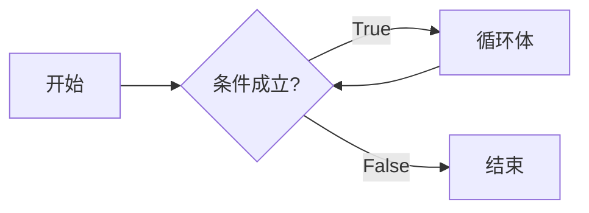

# 顺序结构

顺序结构指程序按代码顺序从上到下依次执行，每条语句依次执行，不发生跳转。

# 分支结构 *

### `if` 语句

Python 条件语句是通过一条或多条语句的执行结果（True 或者 False）来决定执行的代码块。

语法形式：

```python
if 条件表达式1:
    条件1成立执行的代码块
elif 条件表达式2:
    条件2成立执行的代码块
else 
		条件不成立执行的代码块
```

代码示例：

```python
# if 语句
temperature = 25
if temperature > 20:
  print('天气较热，请穿凉爽的衣服。')

# if-else 语句
name = 'amdin'
password = '123456'
if name == 'amdin' and password == '123456':
  print('🟢 登录成功')
else:
  print('🔴 登录失败')

# if-else-if
score = 80
if score >= 90:
  print('优秀')
elif score >= 80:
  print('良好')
elif score >= 60:
  print('及格')
else:
  print('不及格')
```

> **提示**：在 Python 中，没有 `switch` 语句的概念。

Python 中用 **elif** 代替了 **else if**，所以if语句的关键字为：**if – elif – else**。

> **注意**：
>
> - 每个条件后面要使用冒号 **:**，表示接下来是满足条件后要执行的语句块。
> - 使用缩进来划分语句块，相同缩进数的语句在一起组成一个语句块。
> - 在 Python 中没有 **switch...case** 语句，但在 Python3.10 版本添加了 **match...case**，功能也类似，详见下文。

### `match...case` 语句

Python 3.10 增加了 **match...case** 的条件判断，不需要再使用一连串的 **if-else** 来判断了。

match 后的对象会依次与 case 后的内容进行匹配，如果匹配成功，则执行匹配到的表达式，否则直接跳过，**_** 可以匹配一切。

语法格式如下：

```python
match expression:
    case pattern1:
        # 处理 pattern1 的逻辑
    case pattern2 if condition:
        # 处理 pattern2 且满足 condition 的逻辑
    case pattern3 | pattern4:
        # 处理 pattern3 或 pattern4 的逻辑
    case _:
        # 默认处理（通配符）
```

代码示例：

```python
def http_error(status):
    match status:
        case 400:
            return "Bad request"
        case 404:
            return "Not found"
        case 418:
            return "I'm a teapot"
        case _:
            return "Something's wrong with the internet"


print(http_error(400))  # Bad request
```

一个 case 也可以设置多个匹配条件，条件使用 **｜** 隔开，例如：

```python
...
    case 401|403|404:
        return "Not allowed"
```

# 循环结构

日常生活中，我们经常碰到需要一步步完成的事情，比如搭积木建高楼，得一块一块地往上搭建。还有些事情，得一直不停地做，比如公交车和地铁，它们每天不停地在起点和终点之间跑来跑去，为人们提供便利的交通。这种持续重复做同一件事情的情况，我们称之为"**循环**"。简单来说，循环就是重复做某件事情。

在编写程序时，当我们需要重复执行某些代码，比如重复输出 “Hello,World! ” 一百遍，这时就要用到循环结构。通过循环，可以 **简化代码，避免重复书写相同的语句，从而提高编程效率。**

循环流程：



在每次循环之前，程序都会评估一个布尔表达式作为循环条件。这个条件的结果直接决定了循环的下一步行为：如果条件为真(True )，则程序将执行循环体内的代码块，执行完毕后，程序会自动回到条件判断处重新评估。只要条件持续为真(True )，循环体就会不断重复执行。然而，一旦条件评估为假( False )，循环就会立即终止，程序将继续执行循环之后的代码。这样的机制确保了循环能够按照预定的逻辑反复执行，直到达到预期的终止条件。 

## `while`

while 循环是一种基本的循环控制结构，它允许程序在满足特定条件时重复执行一段代码块。这个条件在每次循环开始前都会进行评估，如果条件为真(True)，则执行循环体内的语句，如果条件为假(False)，则退出循环，继续执行 while 循环之后的代码。

语法形式：

```python
while 条件表达式:
  循环体（重复执行的代码）
```

代码示例：

```python
# 需求：输出 5 次 "Hello, World!"
# 定义变量保存次数，初始值为 1
count = 0

# 设置循环条件：次数小于或等于 5
while count < 5:
    # 输出 "Hello, World!"
    print("Hello, World!")
    # 次数加 1
    count += 1


# 需求：计算 1- 5 的和
# 定义变量保存初始值
i = 1
# 定义变量保存综合
sum = 0
# 设置循环条件
while i <= 5:
    # 将当前值加到总和上
    sum += i
    # 更新变量的值
    i += 1
print(f"sum = {sum}")

```

**`while`** 循环嵌套

**示例 1**

```python
i = 1
while i <= 3:
    j = 1
    while j <= 6:
        print(f"第{i}排第{j}列", end="\t")
        j += 1
    print()
    i += 1
```

输出结果：

```
第1排第1列      第1排第2列      第1排第3列      第1排第4列      第1排第5列      第1排第6列
第2排第1列      第2排第2列      第2排第3列      第2排第4列      第2排第5列      第2排第6列
第3排第1列      第3排第2列      第3排第3列      第3排第4列      第3排第5列      第3排第6列
```

**示例 2**

```python
i = 1
# 外层循环
while i <= 9:
    # 内层循环
    j = 1
    while j <= i:
        print(f"{i} * {j} = {i * j}", end="  ")
        j += 1
    print()
    i += 1
    j = 1

```

输出结果：

```
1 * 1 = 1  
2 * 1 = 2  2 * 2 = 4  
3 * 1 = 3  3 * 2 = 6  3 * 3 = 9  
4 * 1 = 4  4 * 2 = 8  4 * 3 = 12  4 * 4 = 16  
5 * 1 = 5  5 * 2 = 10  5 * 3 = 15  5 * 4 = 20  5 * 5 = 25  
6 * 1 = 6  6 * 2 = 12  6 * 3 = 18  6 * 4 = 24  6 * 5 = 30  6 * 6 = 36  
7 * 1 = 7  7 * 2 = 14  7 * 3 = 21  7 * 4 = 28  7 * 5 = 35  7 * 6 = 42  7 * 7 = 49  
8 * 1 = 8  8 * 2 = 16  8 * 3 = 24  8 * 4 = 32  8 * 5 = 40  8 * 6 = 48  8 * 7 = 56  8 * 8 = 64  
9 * 1 = 9  9 * 2 = 18  9 * 3 = 27  9 * 4 = 36  9 * 5 = 45  9 * 6 = 54  9 * 7 = 63  9 * 8 = 72  9 * 9 = 81 
```

**while 循环使用 else 语句**

如果 while 后面的条件语句为 false 时，则执行 else 的语句块。

语法格式如下：

```python
while 条件表达式:
  循环体（重复执行的代码）
else:
  ...
```

代码示例：循环输出数字，并判断大小：

```python
count = 0
while count < 5:
    print(count, " 小于 5")
    count = count + 1
else:
    print(count, " 大于或等于 5")

```

输出结果：

```
0  小于 5
1  小于 5
2  小于 5
3  小于 5
4  小于 5
5  大于或等于 5
```

## `for`

Python for 循环可以遍历任何可迭代对象，如一个列表或者一个字符串。

语法形式：

```python
for 变量 in 可迭代对象:
  循环体（重复执行的代码块）
```

代码示例：

```python
# 遍历字符串（依次去除字符串中的一个个字符）
str = 'ABCDE'
for char in str:
  print(char)

'''
输出结果：
A
B
C
D
E
'''
```

注意：单独的数值类型数据(如整数或浮点数)本身不能直接在 for循环中被依次取值

示例：

```python
for i in 123: 
  print(i)

'''
Traceback (most recent call last):
  File "/Users/lihongyao/Desktop/repositories/python-learns/codes/basics/main.py", line 1, in <module>
    for i in 123: 
             ^^^
TypeError: 'int' object is not iterable
'''
```

### `range` 函数

`range` 函数是 Python 里面一个非常实用的 **小工具**，它可以帮助我们快速 "数" 出一串数字来。这些数字是连续的，比如从1数到 5，或者从 10 数到 20。虽然它数出来的数字不是直接摆在你面前的，但它就像一个 **数字生产机**，当你需要用到这些数字的时候，比如在 `for` 循环里面一个个地处理它们时，`range` 函数就回一个接一个地 “吐” 出这些数字来。

简单来说，`range` 函数是 Python 中的一个内置函数，它用于生成一个数字序列。这个序列通常用于 `for` 循环中，以便对序列中的每个数字执行某些操作。

语法形式：
```python
range(start, stop[, step])
```

- `start`：指定计数的起始值，可以省略，如果省略则从 0 开始。
- `stop`：指定计数的结束值（但不包括该值），不能省略。
- `step`：指定步长，即两个值之间的间隔，可以省略，如果省略则表示步长为 1。

代码示例：

```python
# 起始值：0 结束值：5 步长：1
for i in range(5):    
  print(i)

# 起始值：1 结束值：6 步长：1
for i in range(1, 6): 
  print(i)

# 起始值：1 结束值：6 步长：3 —— 1  1+3 1+3+3 1+3+3+3 —— 1 4 7
for i in range(1, 10, 3): 
  print(i)
```

**示例：使用 `for` 循环计算 1-100 的和**

```python
sum = 0
for i in range(0, 100):
    sum += i
print(f"sum = {sum}")

'''
输出结果：
sum = 5050
'''
```

**示例 2：使用 `for` 循环输出 3x6 列**

```python
for i in range(1, 4):
  for j in range(1, 7):
    print(f'第{i}排第{j}列', end='\t')
  print()

'''
输出结果：
第1排第1列      第1排第2列      第1排第3列      第1排第4列      第1排第5列      第1排第6列
第2排第1列      第2排第2列      第2排第3列      第2排第4列      第2排第5列      第2排第6列
第3排第1列      第3排第2列      第3排第3列      第3排第4列      第3排第5列      第3排第6列
'''
```

# 流程控制

## `break` vs. `continue`

`break` 和 `continue` 是 Python 中专门用于控制循环流程的关键字。

- `break`：跳出当前循环
- `continue`：跳过某 1 次循环

它们必须在循环结构（如 `for` 循环或 `while` 循环）内部使用，并且经常与 `if` 语句联合，以便在满足特定条件时分别退出循环或跳过当前本次循环的剩余部分。然而，这两个关键字不能脱离循环结构，在单独的 `if` 语句（即不在循环体内的 `if` 语句）中直接使用。

错误示例：

```python
i = 1
if i < 3:
  print('哈哈哈')
  break    # SyntaxError: 'break' outside loop
  continue # SyntaxError: 'continue' not properly in loop
```

**示例 1：`break`**

```python
# 吃 5 个苹果
for i in range(1, 6):
  print(f'吃第{i}个苹果')
  # 检查是否是第 3 个苹果
  if i == 3:
    break;

'''
输出结果：
吃第1个苹果
吃第2个苹果
吃第3个苹果
'''
```

**示例 2：`continue`**

```python
# 吃 5 个苹果
for i in range(1, 6):
  # 检查是否是第 3 个苹果
  if i == 3:
    print(f'大虫子，第{i}个不吃了～')
    continue
  print(f'吃第{i}个苹果')

'''
输出结果：
吃第1个苹果
吃第2个苹果
大虫子，第3个不吃了～
吃第4个苹果
吃第5个苹果
'''
```

## `else` 语句

在 Python中，`for` 循环和 `while` 循环都可以与 `else` 语句结合使用。这种结构允许你指定一段代码，该代码在循环正常结束时（即没有通过 `break` 语句提前退出）执行。

### `while...else`

语法形式：

```python
while 条件表达式:
  循环体（重复执行的代码块）
else:
  循环正常结束后要执行的代码块
```

代码示例：

```python
count = 1
while count <= 5:
  print(f'这是第 {count} 次循环')
  count += 1
else:
  print('循环正常结束')


'''
输出结果：
这是第 1 次循环
这是第 2 次循环
这是第 3 次循环
这是第 4 次循环
这是第 5 次循环
循环正常结束
'''
```

### `for...else`

语法形式：

```python
for 变量 in 可迭代对象:
  循环体（重复执行的代码块）
else:
  循环正常结束后要执行的代码块
```

代码示例：
```python
for i in range(1, 6):
  print(f'这是第 {i} 次循环')
else:
  print('循环正常结束')

'''
输出结果：
这是第 1 次循环
这是第 2 次循环
这是第 3 次循环
这是第 4 次循环
这是第 5 次循环
循环正常结束
'''
```

`for...else` 结构在搜索、遍历或处理数据时特别有用，当你需要在找到特定元素时提前退出循环，但又需要在未找到该元素且遍历了整个序列时执行某些操作时。例如，你可以使用它来检查一个序列中是否存在某个值，如果找到了就提前退出，如果遍历了整个序列都没找到，则在 `else` 块中执行一些操作（如一个消息或返回一个默认值）。

总的来说，`while...else` 和 f`or... else` 结构在 Python 中是一种有用的编程模式，它允许你在循环正常结束时执行一些特定的代码。然而，需要注意的是，这种结构并不常见，因为它在某些情况下可能会导致代码的可读性降低。因此，在决定是否使用它时，请仔细考虑你的具体需求和代码的清晰性。
