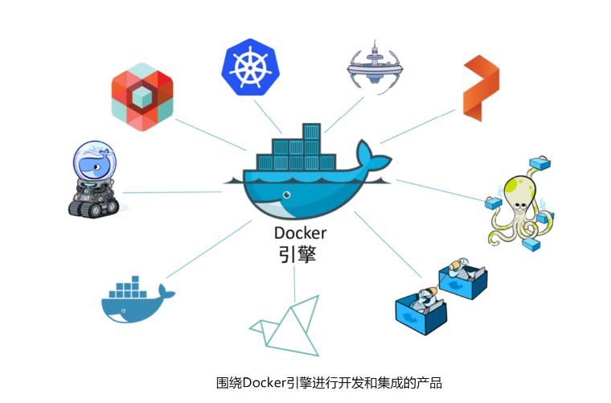
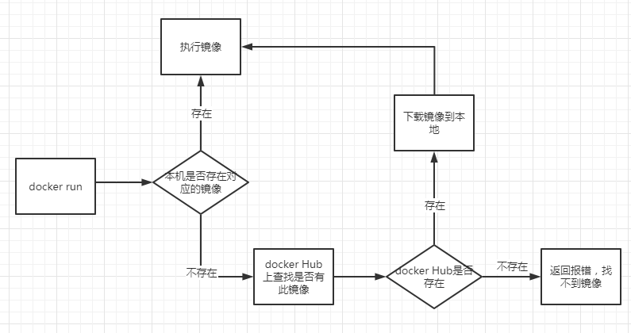

[英文手册 ↪](https://www.docker.com/)

[中文手册 ↪](https://docker.github.net.cn/)


# 概述

Docker 是一个用于开发、发布和运行应用的开放平台。Docker 使你能够将应用与基础设施分离，从而快速交付软件。使用 Docker，你可以像管理应用一样管理基础设施。通过利用 Docker 的代码发布、测试和部署方法，你可以显著减少编写代码到在生产环境中运行之间的时间延迟。

## Docker 为什么会出现？

业务是基于应用（Application）运转的。曾经，每个服务器只能运行单一应用。每次想要增加一个新的应用时，公司就需要去采购一个新的服务器。

由于没有人知道新增应用所需的服务器性能究竟是怎样的，在采购的时候就不得不买那些性能大幅优于业务需求的服务器。这种做法导致了大部分服务器长期运行在他们额定负载5%～10%的水平区间之内。这对公司资产和资源是一种极大的浪费！

## 虚拟机

为了解决上面的问题，VMware公司给全世界带来了一个礼物——虚拟机（VM）。每当需要增加应用的时候，公司无须采购新的服务器。取而代之的是，尝试在现有的，并且有空闲性能的服务器上部署新的应用。

但是虚拟机最大的缺点就是依赖其专用的操作系统（OS）。OS会占用额外的CPU、RAM和存储，这些资源本可以用于运行更多的应用。每个OS都需要补丁和监控。虚拟机技术也面临着一些其他挑战。比如虚拟机启动通常比较慢，并且可移植性比较差——虚拟机在不同的虚拟机管理器（Hypervisor）或者云平台之间的迁移要远比想象中困难。

## 容器

长期以来，像谷歌（Google）这样的大规模Web服务（Big Web-Scale）玩家一直采用容器（Container）技术解决虚拟机模型的缺点。

容器模型其实跟虚拟机模型相似，其主要的区别在于，容器的运行不会独占操作系统。实际上，运行在相同宿主机上的容器是共享一个操作系统的，这样就能够节省大量的系统资源，如CPU、RAM以及存储。

容器同时还能节省大量花费在许可证上的开销，以及为OS打补丁等运维成本。最终结果就是，容器节省了维护成本和资金成本。同时容器还具有启动快和便于迁移等优势。

而Docker是一种运行于Linux和Windows上的软件，用于创建、管理和编排容器。



Docker 运行流程：

```tex
开始
│
├─ Docker会在本机寻找镜像
│   │
│   ├─ [Y] 判断本机是否有这个镜像 → 使用这个镜像运行
│   │
│   └─ [N] 去Docker Hub上下载
│       │
│       ├─ [Y] Docker Hub是否可以找到 → 下载这个镜像到本地 → 使用这个镜像运行
│       │
│       └─ [N] 返回错误，找不到镜像
```

# 安装 Docker

安装 Docker 这里主要介绍两种方式，一种是直接使用 Docker Desktop（本地），另一种是直接在云服务器上安装。

## Docker Desktop（本地）

[参考指南 ↪](https://docker.github.net.cn/get-docker/)

因为我是 macOS 系统，所以这里我就直接选择使用 brew 来进行安装了

```shell
$ brew install --cask docker
$ docker --version
Docker version 28.2.2, build e6534b4
```

添加镜像：

在 `Settgings`  — `Docker Engine` 新增镜像配置：

```json
{
  "registry-mirrors": [
    "https://docker.m.daocloud.io",
    "https://docker.rainbond.cc",
    "https://docker.lmirror.top"
  ]
}
```

## Ubuntu（云服务器）

1. 准备工作，更新源

   百度搜索关键字 <mark>Ubuntu 22.04 国内源</mark> ，如 [这里 ↪](https://blog.csdn.net/xiangxianghehe/article/details/122856771)，以设置清华源为例：

   ```
   # 默认注释了源码镜像以提高 apt update 速度，如有需要可自行取消注释
   deb https://mirrors.tuna.tsinghua.edu.cn/ubuntu/ jammy main restricted universe multiverse
   # deb-src https://mirrors.tuna.tsinghua.edu.cn/ubuntu/ jammy main restricted universe multiverse
   deb https://mirrors.tuna.tsinghua.edu.cn/ubuntu/ jammy-updates main restricted universe multiverse
   # deb-src https://mirrors.tuna.tsinghua.edu.cn/ubuntu/ jammy-updates main restricted universe multiverse
   deb https://mirrors.tuna.tsinghua.edu.cn/ubuntu/ jammy-backports main restricted universe multiverse
   # deb-src https://mirrors.tuna.tsinghua.edu.cn/ubuntu/ jammy-backports main restricted universe multiverse
   deb https://mirrors.tuna.tsinghua.edu.cn/ubuntu/ jammy-security main restricted universe multiverse
   # deb-src https://mirrors.tuna.tsinghua.edu.cn/ubuntu/ jammy-security main restricted universe multiverse
   
   # 预发布软件源，不建议启用
   # deb https://mirrors.tuna.tsinghua.edu.cn/ubuntu/ jammy-proposed main restricted universe multiverse
   # deb-src https://mirrors.tuna.tsinghua.edu.cn/ubuntu/ jammy-proposed main restricted universe multiverse
   ```

   复制上面的内容，然后终端输入如下指令：

   ```shell
   $ vim /etc/apt/sources.list
   ```

   按ESC进入命令模式，输入`gg` 跳转到文件首行，然后输入`dG` 删除从当前行到文件末尾的所有内容，最后按 `p` 粘贴内容，接下来按 `ESC` 输入 `wq!` 保存退出即可。

   ```shell
   $ apt-get update
   $ apt-get upgrade -y
   ```

2. 在安装 Docker Engine 之前，您需要卸载任何冲突的软件包

   ```shell
   $ for pkg in docker.io docker-doc docker-compose docker-compose-v2 podman-docker containerd runc; do sudo apt-get remove $pkg; done
   ```

2. 设置 Docker 的 `apt` 仓库

   ```shell
   $ apt-get update
   $ apt-get install ca-certificates curl
   ```
   
   - `ca-certificates`：确保 HTTPS 连接的安全性
   - `curl`：用于下载 GPG 密钥和文件
   
2. 添加 GPG 密钥（安全增强版）

   ```shell
   $ install -m 0755 -d /etc/apt/keyrings  # 创建安全目录
   $ curl -fsSL https://download.docker.com/linux/ubuntu/gpg -o /etc/apt/keyrings/docker.asc
   $ chmod a+r /etc/apt/keyrings/docker.asc  # 设置可读权限
   ```

   - 密钥存储路径从 `/usr/share/keyrings` 改为 `/etc/apt/keyrings`，符合最新安全规范
   - 权限设置（`0755` 和 `a+r`）防止密钥被篡改

3. 添加仓库源

   ```shell
   $ echo \
     "deb [arch=$(dpkg --print-architecture) signed-by=/etc/apt/keyrings/docker.asc] https://download.docker.com/linux/ubuntu \
     $(. /etc/os-release && echo "${UBUNTU_CODENAME:-$VERSION_CODENAME}") stable" | \
     sudo tee /etc/apt/sources.list.d/docker.list > /dev/null
     
   $ apt-get update
   ```

   - `signed-by` 显式指定密钥路径，避免旧版 `apt-key` 的安全风险
   - 动态获取系统代号（`UBUNTU_CODENAME`）兼容所有 Ubuntu 版本

6. 安装 Docker 软件包

   ```shell
   $ apt-get install docker-ce docker-ce-cli containerd.io docker-buildx-plugin docker-compose-plugin -y
   ```

7. 镜像加速器

   使用 Dcoker 首要操作就是获取镜像文件，默认下载是从Docker Hub下载，网速较慢，国内很多云服务商都提供了加速器服务，[阿里云加速器 ↪](https://cr.console.aliyun.com/)，Daocloud加速器，灵雀云加速器。

   - 修改 Docker 配置文件

     ```shell
     $ mkdir -p /etc/docker
     $ tee /etc/docker/daemon.json <<-'EOF'
     { 
       "registry-mirrors" : 
         [ 
           "https://docker.1panel.live",
           "https://registry.docker-cn.com",
           "https://docker.mirrors.ustc.edu.cn",
           "https://hub-mirror.c.163.com",
           "https://mirror.baidubce.com",
           "https://docker-0.unsee.tech",
           "https://docker-cf.registry.cyou"
         ] 
     }
     EOF
     ```

   - 重启 Docker 服务

     ```shell
     $ systemctl daemon-reload
     $ systemctl restart docker
     ```

8. 验证安装

   ```shell
   $ docker version
   ```

# 初体验

接下来，我们尝试启动一个官方的 docker/welcome-to-docker 容器，感受一下 docker 的魅力。

```shell
# 1.获取 nginx 镜像
$ docker run -d -p 8080:80 docker/welcome-to-docker
Unable to find image 'docker/welcome-to-docker:latest' locally
latest: Pulling from docker/welcome-to-docker
89578ce72c35: Pull complete 
1c2214f9937c: Pull complete 
1fb28e078240: Pull complete 
579b34f0a95b: Pull complete 
94be7e780731: Pull complete 
b42a2f288f4d: Pull complete 
d11a451e6399: Pull complete 
54b19e12c655: Pull complete 
Digest: sha256:eedaff45e3c78538087bdd9dc7afafac7e110061bbdd836af4104b10f10ab693
Status: Downloaded newer image for docker/welcome-to-docker:latest
ac1737b60d58e4b1634d73ba7c06042e976c7c083d16d971ac46df1204292113

# 2. 检查服务器上所有镜像
$ docker images
REPOSITORY                 TAG       IMAGE ID       CREATED         SIZE
docker/welcome-to-docker   latest    eedaff45e3c7   18 months ago   29.7MB

# 3.检查正在运行的docker容器
$ docker ps
CONTAINER ID   IMAGE                      COMMAND                   CREATED              STATUS              PORTS                  NAMES
186e59b074b0   docker/welcome-to-docker   "/docker-entrypoint.…"   About a minute ago   Up About a minute   0.0.0.0:8080->80/tcp   kind_carson
```

参数解读：

1. `docker run`：

   - **作用**：从指定镜像创建并启动一个新容器。

   - **说明**：`run` 是 Docker 的核心命令，结合了 `create`（创建容器）和 `start`（启动容器）两个操作。

2. `-d`：
   - **作用**：以 **后台模式**（守护进程）运行容器，不阻塞当前终端。
   - **注意**：
     - 使用 `-d` 后，容器启动后会返回容器 ID，而非直接输出日志。
     - 若需查看日志，需通过 `docker logs <容器ID>`。

3. `-p 8080:80`：
   - **作用**：将**宿主机的 8080 端口**映射到**容器的 80 端口**。
   - **格式**：`主机端口:容器端口`。
   - **示例效果**：
     - 访问宿主机的 `http://localhost:8080` 会转发到容器的 80 端口。
     - 若未映射端口，外部无法直接访问容器服务。
   - **扩展用法**：
     - 绑定特定 IP：`-p 127.0.0.1:8080:80`
     - 随机主机端口：`-P`（自动分配宿主机端口）
4. `docker/welcome-to-docker`
   - **作用**：指定要运行的**镜像名称**。
   - **说明**：
     - 若本地不存在该镜像，Docker 会从默认仓库（如 Docker Hub）自动拉取。
     - 镜像名称可包含标签（如 `nginx:1.23.4`），未指定时默认为 `latest`。

查看效果：可以通过端口 `8080` 访问前端。要在浏览器中打开网站，请访问 [http://localhost:8080 ↪](http://localhost:8080/)


# 基本指令

```shell
# 1. 检查服务状态（Linux）
$ systemctl status docker
# 2. 检查系统内核
$ uname -a
# 3. 检查是否安装了存储驱动
$ ls -l /sys/class/misc/device-mapper/
# 4. 查看版本信息
$ docker version
# 5. 查看帮助指南
$ docker --help
# 6. 查看docker详细信息，包括镜像、容器数量
$ docker info
```

> 提示：各帮助指南命令请参考 [官方指南 ↪](https://docs.docker.com/reference/cli/docker/)

# 镜像

```shell
# 查看本地镜像
$ docker images 
# 搜索镜像，由于docker默认搜索国外镜像源，而国内镜像源只支持加快拉取，因此搜索功能的生效需要翻墙才行。
docker search xxx
# 拉取镜像
docker pull xxx[:tag]
# 删除镜像
$ docker rmi <IMAGE ID> | <IMAGE NAME> ...
# 查询所有镜像ID
$ docker images -q
# 删除所有镜像
$ docker rmi docker images -q
# 启动镜像
$ docker run -d -p 80:80 nginx
# 加载本地镜像（打包之后的，通常是 .tar.gz 格式）
$ docker load -i xxx.tar.gz
```

## 构建镜像

Dockerfile 是一个文本文件，包含构建镜像的指令。以下是关键指令和示例：

**1）编写一个 Dockfile 文件**

| 指令         | 作用                                             | 示例                                        |
| :----------- | :----------------------------------------------- | :------------------------------------------ |
| `FROM`       | 指定基础镜像（如 Ubuntu、Alpine、Node.js 等）    | `FROM python:3.13-slim`                     |
| `WORKDIR`    | 设置容器内的工作目录                             | `WORKDIR /app`                              |
| `COPY`       | 复制本地文件到镜像中                             | `COPY . /app`                               |
| `RUN`        | 执行命令（如安装依赖）                           | `RUN pip install -r requirements.txt`       |
| `ENV`        | 设置环境变量                                     | `ENV NODE_ENV=production`                   |
| `EXPOSE`     | 声明容器运行时监听的端口（需配合 `-p` 参数映射） | `EXPOSE 8080`                               |
| `CMD`        | ·                                                | `CMD ["python", "app.py"]`                  |
| `ENTRYPOINT` | 类似 `CMD`，但不可被 `docker run` 覆盖           | `ENTRYPOINT ["nginx", "-g", "daemon off;"]` |

**2）构建镜像**

使用 `docker build` 命令构建镜像：

```shell
$ docker build -t my-app:latest .
```

- `-t`：指定镜像名称和标签（如 `my-app:latest`）
- `.`：表示 Dockerfile 所在目录（当前目录）

**3）启动容器**

```shell
$ docker run -d -p 8080:8000 my-app:latest
```

- `-d`：后台运行
- `-p`：端口映射（宿主机端口:容器端口）

**4）验证容器状态**

```shell
$ docker ps           # 查看运行中的容器
$ docker logs <ID>    # 查看日志
```

# 容器

## 查看运行中的容器

```shell
# 1. 查看运行中的容器
docker ps
# 2. 查看所有容器（包括运行和停止）
docker ps -a
# 3. 查看最后一次运行的容器
docker ps -l
# 4. 列出最近创建的 n 个容器
docker ps -n=?
# 5. 显示容器编号
docker ps -q
# 6. 查看已停止的容器
docker ps -f status=exited
```

示例：

```shell
CONTAINER ID   IMAGE                      COMMAND                   CREATED        STATUS                      PORTS                                     NAMES
ac1737b60d58   docker/welcome-to-docker   "/docker-entrypoint.…"   38 hours ago   Exited (255) 14 hours ago   0.0.0.0:8080->80/tcp                      sweet_payne
```

解读：

- `CONTAINER ID`：容器ID

- `IMAGE`：所属镜像
- `COMMAND`：启动容器时运行的命令
- `CREATED`：创建时间
- `STATUS`：容器状态
- `PORTS`：端口
- `NAMES`：容器名称

## 创建并运行容器

Docker用 Registry 来保存用户构建的镜像。Registry 分为公共和私有两种。Docker公司运营公共的 Registry 叫做Docker Hub。用户可以在Docker Hub注册账号，分享并保存自己的镜像。

Docker公司提供了公共的镜像仓库 `https://hub.docker.com`（Docker 称之为 Repository）提供了庞大的镜像集合供使用。

一个Docker Registry 中可以包含多个仓库（Repository），每个仓库可以包含多个标签（Tag），每个标签对应一个镜像。

通常，一个仓库会包含同一个软件不同版本的镜像，而标签对应该软件的各个版本。我们可以通过 `<仓库名>:<标签>` 的格式来指定具体是这个软件哪个版本的镜像。如果不给出标签，将以latest作为默认标签。



下面为 Docker 创建并运行容器的命令

```shell
$ docker run [可选参数] image
```

参数说明

- `-i`：表示运行容器

- `-t`：表示容器启动后会进入其命令行，加入这两个参数后，容器创建就能登录进去，即分配一个伪终端

- `--name`：为创建的容器命名，例如tomcat1，tomcat2，用来区分容器

- `-v`：表示目录映射关系（前者是宿主机目录，后者是映射到宿主机上的目录），可以使用多个 -v 做多个目录或文件映射。

  注意：最好做目录映射，在宿主机上做修改，然后共享到容器上

- `-d`：在 run 后面加上 -d 参数，则会创建一个守护式容器在后台运行（这样创建容器后不会自动登录容器，如果只加 -i -t 两个参数，创建容器后就会自动进容器里）

- `-p`：表示端口映射，前者是宿主机端口，后者是容器内的映射端口。可以使用多个 -p 做多个端口映射。

- `-P`：随机使用宿主机的可用端口与容器内暴露的端口映射

1）**创建并进入容器**

```shell
$ docker run -it --name <CONTAINER NAME> <IMAGEN AME>:TAG /bin/bash
```

上面这行命令的意思就是通过镜像 AA 创建一个容器 BB，运行容器并进入容器的 /bin/bash。

> **注意**：Docker容器运行必须有一个前台进程，如果没有前台进程执行，容器认为是空闲状态，就会自动退出。

2）**守护式方式创建容器**

```shell
$ docker run -di --name <CONTAINER NAME> <IMAGEN AME>:TAG
```

创建一个守护式容器在后台运行（这样创建容器后不会自动登录容器，如果只加 `-i` `-t` 两个参数，创建容器后就会自动进容器里）

3）**登录守护式容器方式 — 进入容器内部**

在指定的运行中 Docker 容器内启动一个新的交互式 Bash shell 会话，允许用户直接在容器内部执行命令和操作文件系统等任务。这对于调试、检查容器内部状态或者进行实时修改都非常有用。

```shell
$ docker exec -it <CONTAINER NAME> | <CONTAINER ID> /bin/bash
```

> **注意**：这条命令不会创建一个新的容器，而是作用于已经存在的且正在运行的容器上。如果你尝试对未运行的容器使用这个命令，将会失败。

进入容器内部后，按以下方式退出：

1. 安全退出，容器不会停止：在容器终端中按下 <kbd>Ctr</kbd> + <kbd>P</kbd> 后紧接着按下 <kbd>Ctr</kbd> + <kbd>Q</kbd>。
2. 停止容器并退出：`exit`

## 删除容器

```shell
# 删除指定容器，-f 表示强制删除
$ docker rm <CONTAINER ID | CONTAINER NAME> [-f]
# 删除所有容器
$ docker rm -f $(docker ps -aq)
```

## 停止和启动容器

```shell
# 停止容器
$ docker stop <CONTAINER ID | CONTAINER NAME> ...
# 启动容器
$ docker start <CONTAINER ID | CONTAINER NAME> ...
# 重启容器
$ docker restart <CONTAINER ID | CONTAINER NAME> ...
# 强制停止容器 
$ docker kill <CONTAINER ID | CONTAINER NAME> ...
```

## 文件拷贝

有时候我们想在主机与Docker容器之间进行文件传输，但又不想先登录到容器内部再手动拷贝文件，`docker cp` 命令可以帮助我们解决问题。

1）**容器外拷贝到容器内**

如果我们需要将文件拷贝到容器内可以使用cp命令

```shell
$ docker cp 需要拷贝的文件或目录 容器名称:容器目录
```

例如，如果你想将主机上的 `/home/user/data.txt` 文件拷贝到名为 `my_container` 的容器内的 `/app/data/` 目录下，可以使用如下命令：

```shell
$ docker cp /home/user/data.txt my_container:/app/data/
```

2）**容器内拷贝到容器外**

也可以将文件从容器内拷贝出来。

```shell
$ docker cp 容器名称:容器目录 需要拷贝的文件或目录
```

例如，如果想把名为 `my_container` 的容器内的 `/app/data/report.txt` 文件拷贝到主机的 `/home/user/reports/` 目录下，你可以执行以下命令：

```shell
$ docker cp my_container:/app/data/report.txt /home/user/reports/
```

## 其他常用命令

1）**显示日志**

```shell
docker logs [-tf] [-tail number] <CONTAINER ID> | <CONTAINER NAME>
# 参数
-tf          # 显示日志
-tail number # 指定日志条数
```

2）**查看容器进程**

```shell
docker top <CONTAINER ID> | <CONTAINER NAME>
```

3）**查看元数据**

```shell
docker inspect <CONTAINER ID> | <CONTAINER NAME>
```

# Docker Compose

## 概述

Docker Compose 是 Docker 官方提供的**多容器编排工具**，用于通过一个 YAML 文件（`docker-compose.yml`）定义和管理多个容器的配置、依赖关系及资源（如网络、卷等）。它的核心功能包括

1. 声明式配置：通过 YAML 文件描述应用的服务、网络和卷，简化多容器部署。

2. 一键启停：使用 `docker-compose up` 和 `docker-compose down` 快速启动或销毁整个应用栈。

3. 服务依赖管理：自动处理容器启动顺序（如数据库先于应用启动）。

4. 开发与生产通用：适用于本地开发、测试环境及小型生产部署。

**典型使用场景**：

- 微服务架构（如前端 + 后端 + 数据库）
- 快速搭建开发环境（如 Nginx + PostgreSQL + Redis）

## 编写 `docker-compose.yml`

```yaml
version: '3.8'  # 指定 Compose 版本（非必需）
services:
  web:  # 服务名称
    image: nginx:latest  # 使用镜像
    ports:
      - "8080:80"  # 宿主机端口:容器端口
    volumes:
      - ./html:/usr/share/nginx/html  # 挂载静态文件
    depends_on:
      - db  # 依赖 db 服务
    networks:
      - app-net  # 自定义网络

  db:
    image: postgres:latest
    environment:
      POSTGRES_PASSWORD: example  # 环境变量
    volumes:
      - db-data:/var/lib/postgresql/data  # 持久化数据

volumes:
  db-data:  # 定义命名卷

networks:
  app-net:  # 自定义网络
    driver: bridge
```

**关键配置说明**：

- `services`：定义容器服务（如 `web`、`db`），支持镜像、端口、卷挂载等
- `volumes`：持久化数据（如数据库文件）
- `networks`：自定义网络实现服务间通信（通过服务名访问，如 `web` 可通过 `db` 主机名连接数据库）

## 常用指令

**服务管理**

1. `docker-compose up -d`：启动服务（后台模式）
2. `docker-compose down`：停止并删除容器、网络、卷（添加`-v`删除匿名卷）
3. `docker-compose ps`：查看容器状态（显示名称、端口、运行状态）
4. `docker-compose logs -f <service_name>`：实时查看服务日志（`-f`跟踪输出）
5. `docker-compose restart <service_name>`：重启指定服务

**调试与维护**

- `docker-compose exec <service_name> <command>`：进入容器执行命令（如`exec web bash`）
- `docker-compose build`：重新构建服务镜像（配合`--no-cache`禁用缓存）
- `docker-compose pull`：拉取服务的最新镜像

# 部署

```shell
$ df -h /opt # 查看 /opt 目录用量
```

```bash
/opt/apps/
.
├── project_a/
│   ├── frontend/               # 前端项目
│   │   ├── docker-compose.yaml # Compose 配置文件
│   │   ├── nginx/
│   │   │   ├── nginx.conf      # 主配置文件
│   │   │   └── conf.d/         # 子配置目录（可选）
│   │   ├── dist/               # 前端构建后的静态文件（如 index.html）
│   │   ├── certs/              # SSL 证书目录（可选）
│   │   └── logs/               # 日志目录（可选）
│   ├── backend/                # 后端项目
│   └── data/                   # 统一数据卷
│       ├── mysql/
│       └── redis/
└── project_a ...
```

## FastAPI（uvicorn）

```dockerfile
FROM python:3.13-slim

WORKDIR /app 
COPY . /app 

RUN apt-get update && \
    apt-get install -y python3-dev libpq-dev tini vim procps gcc  && \
    pip install --no-cache-dir -r /app/requirements.txt && \
    apt-get clean && rm -rf /var/lib/apt/lists/*

CMD ["tini", "-s", "uvicorn", "app.main:app", "--host", "0.0.0.0", "--port", "8000"]
```

分析：

1）**基础镜像选择**

```
FROM python:3.13-slim
```

**作用**：使用官方 Python 3.13 的轻量级镜像（`slim` 版本），减少镜像体积

2）**工作目录设置**

```dockerfile
WORKDIR /app
COPY . /app
```

**作用**：

- `WORKDIR`：设置容器内的工作目录为 `/app`，后续命令（如 `COPY`、`RUN`）均在此目录执行
- `COPY`：将宿主机当前目录（Dockerfile 所在目录）的所有文件复制到容器的 `/app` 目录。

3）**依赖安装与系统工具配置**

```dockerfile
RUN apt-get update && \
    apt-get install -y python3-dev libpq-dev tini vim procps gcc && \
    pip install --no-cache-dir -r /app/requirements.txt && \
    apt-get clean && rm -rf /var/lib/apt/lists/*
```

**作用**：

- **系统依赖**：

  - `python3-dev`、`libpq-dev`、`gcc`：支持 Python 扩展（如 `psycopg2`）的编译。

  - `tini`：作为轻量级初始化进程，解决僵尸进程问题。

  - `vim`、`procps`：调试工具（非必需，可移除）。

- **Python 依赖**：
  - `pip install`：安装 `requirements.txt` 中的依赖，`--no-cache-dir` 减少镜像体积。

- **清理缓存**：
  - `apt-get clean` 和 `rm -rf` 删除临时文件，优化镜像大小。

4）**容器启动命令**

```dockerfile
CMD ["tini", "-s", "uvicorn", "app.main:app", "--host", "0.0.0.0", "--port", "8000"]
```

**作用**：

- 使用 `tini` 启动 `uvicorn`，运行 FastAPI 应用（入口为 `app.main:app`），监听 8000 端口。
- `-s`：`tini` 的简化模式，适合轻量级容器。

## nginx

1）**构造必要文件**（建议拷贝，作为参照）

```shell
$ mkdir -p /opt/deploy
$ sudo chmod -R 755 /opt/deploy/
$ 
mkdir -p /opt/deploy/{conf.d,html,logs,certs} && \
touch /opt/deploy/docker-compose.yaml && \
touch /opt/deploy/nginx.conf && \
touch /opt/deploy/conf.d/default.conf && \
touch /opt/deploy/logs/{access.log,error.log}
```
目录结构如下：
```shell
/opt/deploy:
.
├── certs                  # SSL证书目录
│   ├── xxx.cn.pem         # 证书文件
│   └── xxx.cn.key         # 私钥文件
├── conf.d                 # 子配置
│   └── default.conf       # 站点配置
├── docker-compose.yaml    # 编排文件
├── html                   # 前端静态资源
├── logs                   # 日志
│   ├── access.log         # 访问日志
│   └── error.log          # 错误日志
└── nginx.conf             # 主配置文件
```

2）**编写docker-compose.yaml**

```yaml
services:
  nginx:
    image: nginx:latest
    container_name: nginx-xxx
    volumes:
      # 静态资源
      - ./html:/usr/share/nginx/html
      # 配置文件
      - ./nginx.conf:/etc/nginx/nginx.conf:Z
      - ./conf.d:/etc/nginx/conf.d
      # SSL证书
      - ./certs:/etc/nginx/certs
      # 日志持久化
      - ./logs:/var/log/nginx
    ports:
      - "80:80"
      - "443:443"
    restart: unless-stopped
    environment:
      - TZ=Asia/Shanghai  # 时区设置
```

> **提示**：挂载目录中的字符
>
> - `Z`：自动权限修正

3）**编写配置文件**

> **`nginx/nginx.conf`**

```nginx
user nginx;

worker_processes auto;

error_log /var/log/nginx/error.log notice;

pid /var/run/nginx.pid;

events {
  worker_connections 1024;
}

http {
  include /etc/nginx/mime.types;
  default_type application/octet-stream;

  log_format main '$remote_addr - $remote_user [$time_local] "$request" '
  '$status $body_bytes_sent "$http_referer" '
  '"$http_user_agent" "$http_x_forwarded_for"';

  access_log /var/log/nginx/access.log main;

  sendfile on;
  sendfile_max_chunk 100k;
  tcp_nopush on;

  keepalive_timeout 65;
  keepalive_requests 100;

  include /etc/nginx/conf.d/*.conf;
}
```

> **`nginx/conf.d/default.conf`**

```nginx
server {
  listen 443 ssl;
  server_name xxx.xxx.cn;

  client_max_body_size 70m;
  add_header Accept-Ranges bytes;

  ssl_session_timeout 5m;
  ssl_session_cache shared:SSL:10m;

  ssl_protocols TLSv1.2 TLSv1.3;
  ssl_ciphers 'ECDHE-ECDSA-AES256-GCM-SHA384:ECDHE-RSA-AES256-GCM-SHA384';
  ssl_prefer_server_ciphers on;

  ssl_certificate /etc/nginx/certs/xxx.cn.pem;
  ssl_certificate_key /etc/nginx/certs/xxx.cn.key;

  add_header Strict-Transport-Security "max-age=31536000; includeSubDomains" always;
  add_header X-Content-Type-Options "nosniff";
  add_header X-Frame-Options "SAMEORIGIN";

  location /api/ {
    proxy_pass http://196.20.20.11:8000/api/;
  }
  location /mgr/ {
    proxy_pass http://196.20.20.11:8000/mgr/;
  }
}

server {
  listen 80;
  server_name xxx.xxx.cn;
  return 301 https://$host$request_uri;
}
```

4）**部署静态文件**

```shell
# 将前端打包文件（如dist/*）复制到html目录
cp -r dist/* /opt/deploy/html/

# 确保权限正确（Nginx容器用户UID 101）
sudo chown -R 101:101 /opt/deploy/html
```

5）**启动与验证**

```shell
# 启动服务
cd /opt/deploy && docker-compose up -d

# 验证容器状态
docker-compose ps

# 查看实时日志
docker-compose logs -f nginx

# 访问测试
curl -I http://localhost       # 应返回301跳转HTTPS
curl -Ik https://localhost     # 验证SSL证书和200状态
```

# 应用场景

## 本地运行别人的镜像

```shell
$ docker load -i xxx.tar.gz
$ docker images
$ docker-compose up -d
```

# 参考指南

1. [懂了！VMware/KVM/Docker原来是这么回事儿 ↪](https://developer.aliyun.com/article/768343)
1. [docker学习使用教程 ↪](https://blog.csdn.net/qq_40610003/article/details/144147120)
